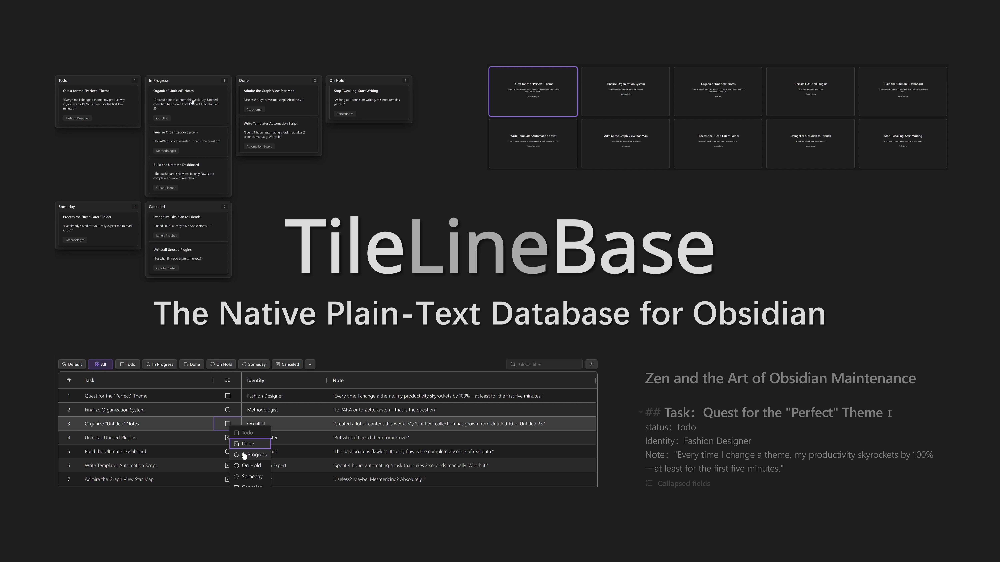
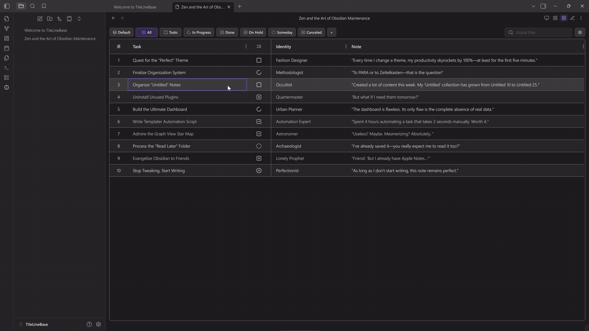
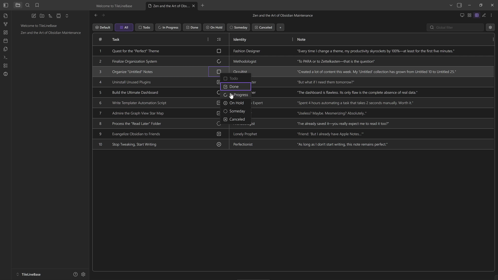
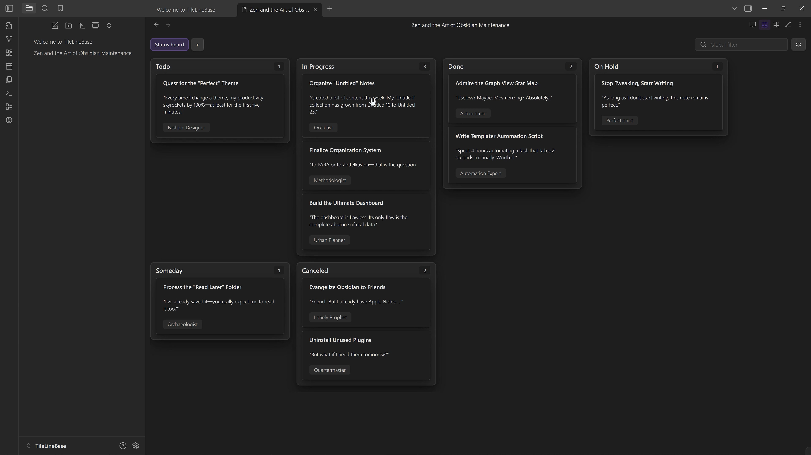
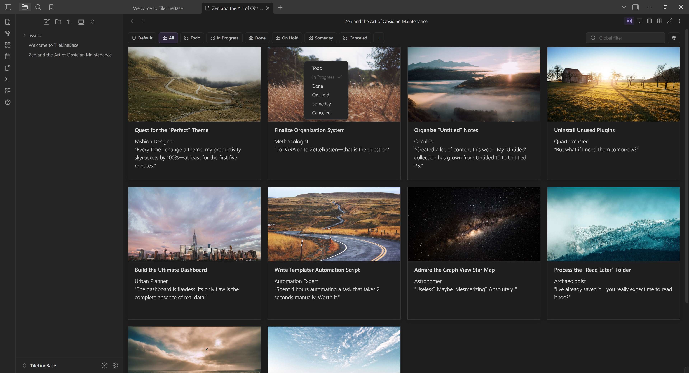
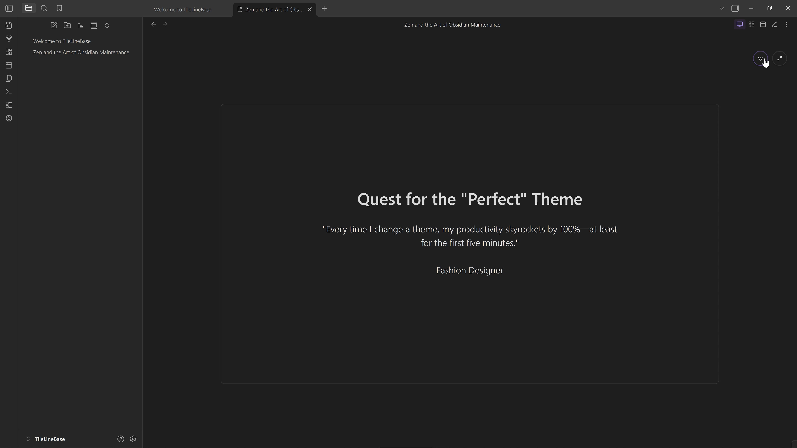
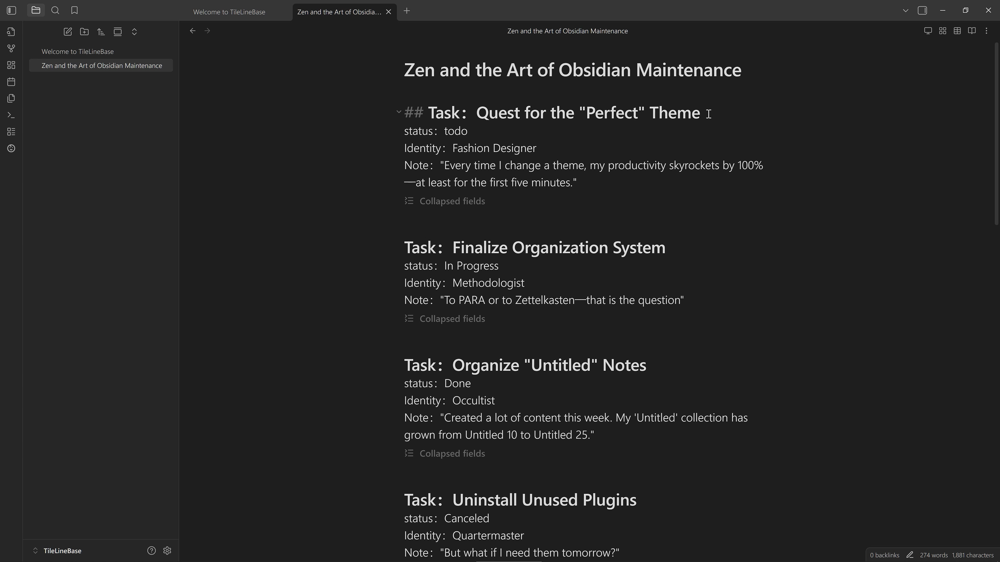

  
    <a href="README.md">English</a> ·
    <a href="README.de.md">Deutsch</a> ·
    <a href="README.es.md">Español</a> ·
    <a href="README.fr.md">Français</a> ·
    <a href="README.it.md">Italiano</a> ·
    <a href="README.ja.md">日本語</a> ·
    <a href="README.ko.md">한국어</a> ·
    <a href="README.nl.md">Nederlands</a> ·
    <a href="README.pl.md">Polski</a> ·
    <a href="README.pt.md">Português</a> ·
    <a href="README.zh-hans.md">简体中文</a> ·
    <a href="README.zh-hant.md">繁體中文</a>
  

# TileLineBase

> **Die native Plain-Text-Datenbank für Obsidian**

Erstelle **mehrdimensionale Tabellen** direkt in deinen Markdown-Notizen. **Kein Frontmatter. Kein Code.**

## Schnellvorschau

_Klicke auf die Vorschau oben, um sie in höherer Qualität auf YouTube anzusehen._

## Funktionen

### Eine leistungsstarke und intelligente Tabelle

Erstelle strukturierte Datentabellen direkt in deinen Markdown-Notizen, flexibel einsetzbar für viele unterschiedliche Szenarien.

#### Flexible Ansichten: Tabelle, Kanban, Galerie und Folien

Ein Datensatz, vier leistungsstarke Arten der Interaktion:

- **Gefilterte Tabelle:** Kombiniere **Filter**- und **Sortierregeln** frei zu gespeicherten Ansichten. Betrachte deine Daten nach Projekt oder Status und nutze vollständige Unterstützung für **mehrzeilige Textbearbeitung**.

- **Kanban Board:** Weise **jedes Select- oder List-Feld** Spalten zu, nicht nur Status. Gruppiere deine Daten mühelos nach Priorität, Tags oder Autor, um eine andere Dimension deiner Notizen sichtbar zu machen.

- **Galerieansicht:** Visualisiere Notizen als vollständig anpassbare Karten. **Gestalte eigene Layouts** mit der **Template Engine** und organisiere Inhalte effizient mit **View Groups** und **Rechtsklick-Aktionen**.

- **Folienansicht:** Verwandle Zeilen in fokussierte Folien, ideal für ablenkungsfreies Denken oder einfache Präsentationen. Passe **Layouts** bequem an, mit integrierter Unterstützung für **Inline-Bilder** und **Live-Vorschauen**.

#### Hierarchische Zeilen

Nutze den **Parent-Child Row Mode**, um zusammengehörige Einträge in einer zweistufigen Hierarchie zu gruppieren und trotzdem natürlich mit gefilterten Tabellenansichten zu arbeiten.

#### Intelligente Felder

Einfache **Inline-Formeln** (simple Arithmetik), **intelligente Datums- und Zeitinterpretation** sowie **automatische Verlinkung** von Notizen und Referenzen, nahtlos integriert und kontinuierlich weiterentwickelt.

#### Integrierter GTD-Workflow

Enthält **integrierte Aufgabenstatusfelder** (Todo, In Progress, Done, On Hold, Someday, Canceled) sowie passende gefilterte View Groups und Kanban-Ansichten. So kannst du **sofort und unkompliziert Aufgaben verwalten**.

### Eine Datenbank, die nativ in Text lebt

Vollständig textbasiert, frei von komplexen Datenformaten und zusätzlichem Markup, mit intuitiver Unterstützung für strukturierte Inhalte.

#### Eine einzelne Notiz als Datenbank

Fasse alle zusammengehörigen strukturierten Einträge eng in **einer einzigen `.md`-Notiz** zusammen. Das erhält **kontextuelle Zusammenhänge**, reduziert Verwaltungsaufwand und unterstützt Überblick, Review und Denken.

#### Implizite Strukturierung

Kein Frontmatter, kein Code-Markup. Die Datenstruktur ist **implizit im Klartext enthalten** und bietet eine **menschen- und maschinenfreundliche** Darstellung, die sich natürlich lesen und schreiben lässt.

### Offene Dateninteraktion

Unterstützt bequeme Dateninteraktion und Datenbewegung über verschiedene interne und externe Plattformen hinweg, damit Informationen flexibler organisiert und genutzt werden können.

#### Textimport-Assistent

Wandle Textblöcke schnell in gültige TileLineBase-Einträge um. Definiere einfache Muster, um Inhalte Feldern zuzuordnen, und **erzeuge die benötigte Struktur sofort**, ohne manuelle Formatierung.

#### Nahtlose Obsidian-Integration

Einträge lassen sich flexibel zwischen verschiedenen Tabellennotizen verschieben oder in **eigenständige Obsidian-Notizen** umwandeln; Tabellennotizen können außerdem **zwischen Vaults migriert** werden, wobei alle Konfigurationen erhalten bleiben.

#### Einfache Spreadsheet-Synchronisierung

Unterstützt **CSV-Import und -Export**, ist mit gängiger Tabellenkalkulationssoftware kompatibel und ermöglicht **Stapelbearbeitung** und Datenorganisation.

#### Effiziente Kommunikation mit LLMs

Verwendet ein **klares, in sich geschlossenes Plain-Text-Format**, das ohne zusätzliche Verarbeitung nahtlos mit **Large Language Models (LLM)** interagieren kann.

## Sicherheit & Architektur

*   **Isolation:** Das Plugin verarbeitet **nur** die konkrete Datei, in der du zur TileLineBase-Ansicht wechselst. Es durchsucht niemals deine anderen Notizen.
*   **Entkopplung:** Deine Daten bleiben in der `.md`-Datei. Ansichtseinstellungen bleiben im Plugin. Deine Notizen bleiben standardkonformes Markdown, selbst wenn du das Plugin deinstallierst.
*   **Schutz:** Die integrierte automatische Sicherung bewahrt eine Historie von Dateischnappschüssen auf und hilft, versehentlichen Datenverlust zu vermeiden.

## Installation

Installiere TileLineBase über die [Obsidian Community Plugins page](https://community.obsidian.md/plugins/tile-line-base) oder öffne es direkt in Obsidian mit `obsidian://show-plugin?id=tile-line-base`.

TileLineBase ist nur für Desktop verfügbar.

## Entwicklung

Installiere für die lokale Entwicklung die Abhängigkeiten mit `npm ci`.

Verwende `npm install <package>` nur, wenn du bewusst eine Abhängigkeit hinzufügst, entfernst oder aktualisierst und `package-lock.json` neu erzeugen musst.

Führe nach Änderungen an Abhängigkeiten `npm run deps:hardening:check` aus.

## Tipps & Anpassungen

- [Status Icon and Row Background Customization](docs/status-snippet-guide.md)

## Feedback & Diskussion

Feedback, Vorschläge, Fragen und Bug Reports sind willkommen, wo immer du sie am liebsten diskutierst.

Du kannst:

* Der Unterhaltung im [Obsidian Forum thread](https://forum.obsidian.md/t/tilelinebase-the-native-plain-text-database-for-obsidian/108734) beitreten oder eine neue starten.
* Ein Issue auf [GitHub](https://github.com/campfirium/obsidian-tile-line-base/issues) eröffnen, wenn du etwas formeller nachverfolgen möchtest.
* Oder in meinem persönlichen Forum [Campfirium](https://forum.campfirium.com/t/tilelinebase-v080-released-the-native-plain-text-database-for-obsidian/753) vorbeischauen, wo auch breitere Ideen und Nebendiskussionen willkommen sind.

Nutze einfach den Ort, der für dich am besten passt.

## Danksagungen

TileLineBase baut auf hervorragender Open-Source-Arbeit auf:

- [Obsidian](https://obsidian.md/) und die Obsidian plugin API.
- [AG Grid](https://www.ag-grid.com/) für das zentrale Interaktionsmodell der Tabelle.
- [Lucide](https://lucide.dev/) für das Icon-Set, das von Obsidian und den Icon-Workflows von TileLineBase verwendet wird.
- [SortableJS](https://sortablejs.github.io/Sortable/) für Drag-and-Drop-Interaktionen.
- [monkey-around](https://github.com/pjeby/monkey-around) für Runtime-Patching-Unterstützung im Obsidian-Plugin-Ökosystem.

Siehe [THIRD_PARTY_NOTICES.md](THIRD_PARTY_NOTICES.md) für Hinweise zu Drittanbieterkomponenten und Lizenzen.

## Lizenz

TileLineBase wird unter der MIT License veröffentlicht.
