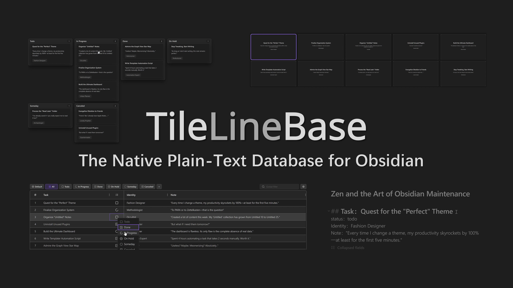
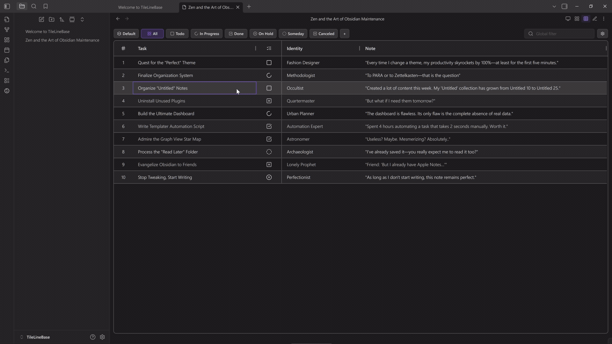
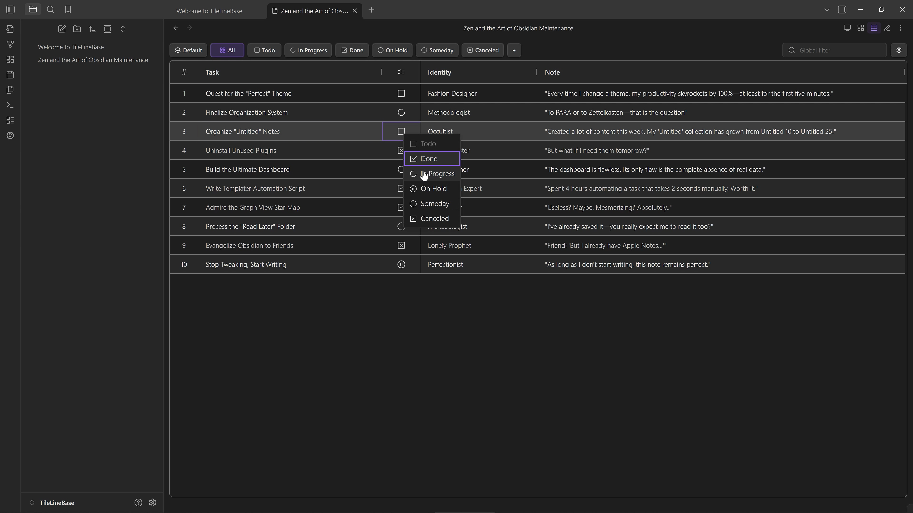
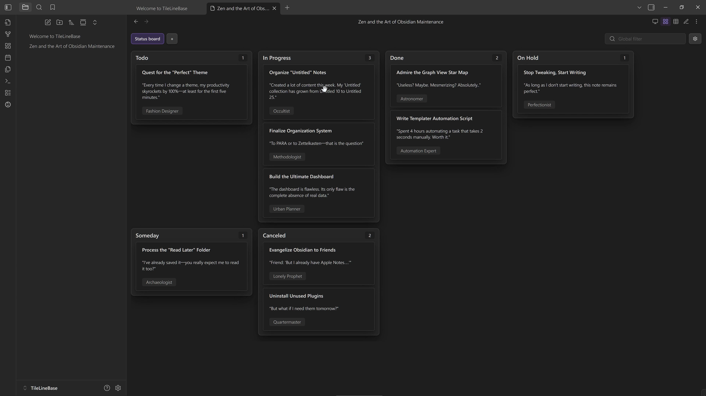
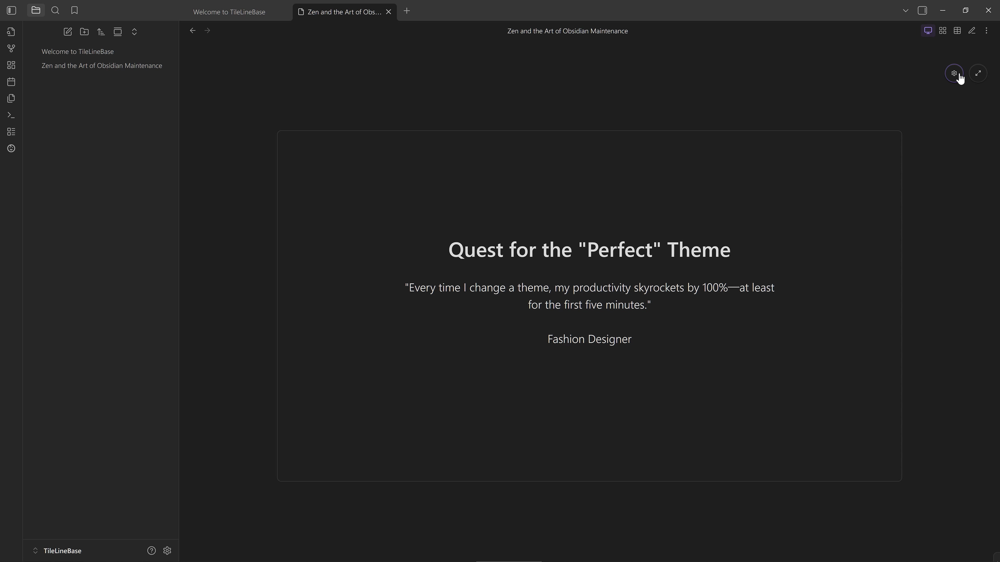
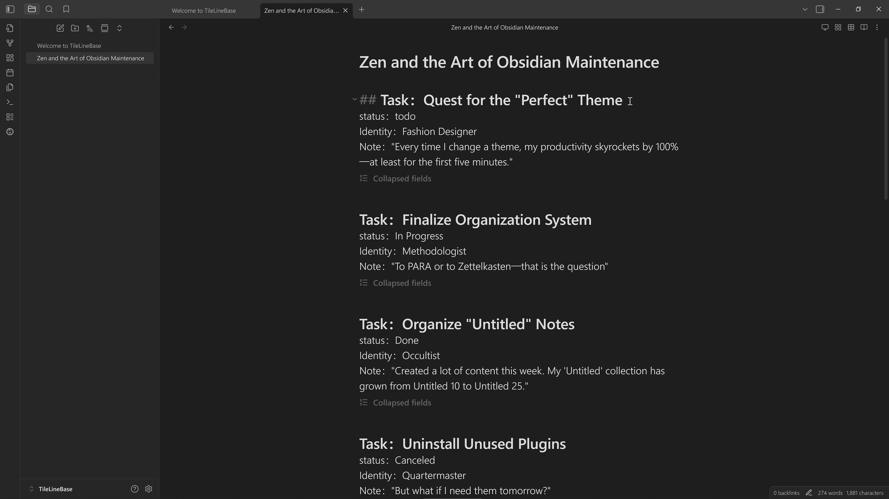

# TileLineBase

> **The Native Plain-Text Database for Obsidian**

 

Build advanced tables right inside your Markdown notes, all from plain text. **Zero Frontmatter. Zero code.**

## Quick Preview

_Click the preview above to watch in higher quality on YouTube._

## Features

### A Powerful & Intelligent Table

Create structured data tables directly within your Markdown notes, flexibly supporting various scenarios.

#### Flexible Views: Table, Kanban & Slides

One set of records, three powerful ways to interact:

- **Filtered Table:** Freely combine **Filter** and **Sort** rules into saved views. Slice your data by project, status, or any custom condition.

- **Kanban Board:** Map **any Select or List field** to lanes—not just Status. Easily regroup your data by Priority, Tags, or Author to see a different dimension of your notes.

- **Slide View:** Turn rows into focused slides—perfect for distraction-free thinking or simple presentations. Easily **customize layouts**, with built-in support for **inline images** and **live previews**.

#### Smart Fields

Basic **inline formulas** (simple arithmetic), **intelligent date/time parsing**, and **automatic linking** of notes and references—all seamlessly integrated and continuously refined.

#### Built-in GTD Workflow

Comes with **built-in task status fields** (Todo, In Progress, Done, On Hold, Someday, Canceled), providing corresponding filtered view groups and Kanban views by default, enabling **immediate and easy task management**.

### A Database Native to Text

Fully text-based, free from complex data formats and extra markup, intuitively supporting structured content.

#### Single Note as Database

Aggregate all related structured records tightly within a **single `.md` note**. This maintains **contextual associations**, reduces management overhead, and effectively facilitates overall review and thinking.

#### Implicit Structuring

No Frontmatter, no code markup. The data structure is **implicitly contained** within plain text, providing a **human- and machine-friendly** data representation that lets you read and write naturally.

### Open Data Interaction

Supports convenient data interaction and movement across various internal and external platforms, enabling more flexible organization and utilization of information.

#### Text Import Wizard

Quickly transform text blocks into valid TileLineBase records. Define simple patterns to map content to fields, **instantly generating the required structure** without manual formatting.

#### Seamless Obsidian Integration

Records can move flexibly across different table notes or be converted into **standalone Obsidian notes**; table notes can also be **migrated across Vaults** with all configurations intact.

#### Easy Spreadsheet Sync

Supports **CSV import/export**, compatible with mainstream spreadsheet software, allowing **batch editing** and data organization.

#### Efficient LLM Communication

Uses a **clear, self-contained plain-text format** that can interact seamlessly with **Large Language Models (LLM)** without additional processing

## Installation

TileLineBase is currently in **Early Beta** and is not yet available via Obsidian's Community Plugins list. You can install it via **BRAT** or manually:

### Via BRAT (Recommended)
1. Install **BRAT** from Community Plugins.
2. Run command `BRAT: Add a beta plugin for testing`.
3. Enter URL: `https://github.com/campfirium/obsidian-tile-line-base`

<strong>Manual Installation (Click to expand)</strong>

1. Download `main.js`, `manifest.json`, and `styles.css` from the [Latest Release](https://github.com/campfirium/obsidian-tile-line-base/releases).
2. Create a folder `obsidian-tile-line-base` in your vault's `.obsidian/plugins/` directory.
3. Move the files into that folder.
4. Reload Obsidian and enable the plugin.

## Feedback & Discussion

We welcome feedback, suggestions, and bug reports! Feel free to:

* [Open an Issue on GitHub](https://github.com/campfirium/obsidian-tile-line-base/issues) for specific bugs or technical feedback.
* Join the conversation and share your thoughts about TileLineBase on the [Obsidian forum thread](https://forum.obsidian.md/t/tilelinebase-the-native-plain-text-database-for-obsidian/108734).
* For broader discussions, questions, or general productivity tips, visit my personal forum at [Campfirium](https://campfirium.info/t/tilelinebase-v080-released-the-native-plain-text-database-for-obsidian/753).

## Acknowledgements

Special thanks to [AG Grid](https://www.ag-grid.com/) for providing excellent grid functionalities, which significantly enhanced the table interactions in TileLineBase.

## License

TileLineBase is released under the MIT License.